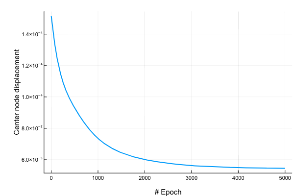

# Design by Gradient Descent

## Overview

How can recent advancements in Machine Learning be applied to the fields of engineering design?

The vision for this project is to develop a methodology of calculating the gradient for the performance of a design relative to a set of design parameters.

**Short term**, the design can then be iteratively improved by applying gradient descent directly to these same parameters.

**Long term**, a generative model (neural network) can be used to generate this large set of parameters from a reduced set of inputs. This generative model can then be trained via back propagating the same gradients

## Example

An initial example application of this methodology is in the design of structural trusses.

Here a truss architecture is initialised (a set of nodes & edges) and then the geometry of this design is modified to reduce the loaded displacement of the central node.

